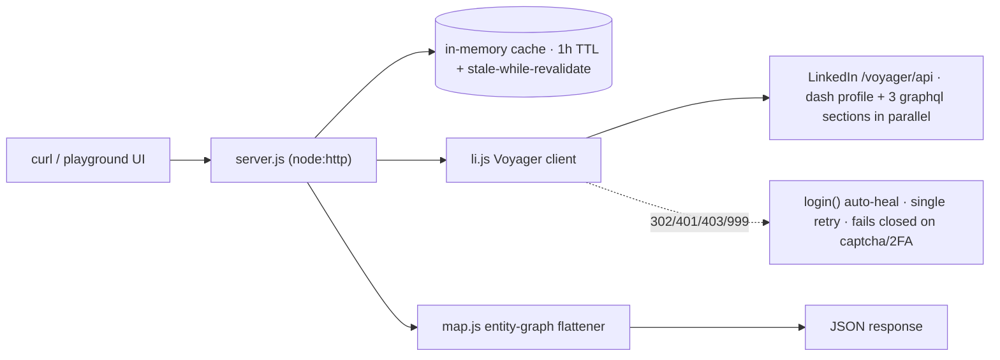

# Design — LinkedIn Profile API

Design-before-code artifact. The system design, API contract, and UI design system are defined here first; `server.js`, `li.js`, `map.js`, and `public/index.html` implement exactly this. Change the design here first, then the code.

## 1. System design

**What:** a hosted HTTPS API that accepts a public LinkedIn profile URL and returns the profile as structured JSON, plus a one-page playground UI that demonstrates it.

**How:** pure reverse-engineered HTTP against LinkedIn's internal Voyager endpoints — the same calls the linkedin.com frontend makes. No browser automation, no SDKs, zero npm dependencies.

**Flow:** slug extracted with a strict regex → cache lookup (fresh < 1h served; stale < 2h served + background revalidate; miss fetched) → one dash-profile call returns the whole entity graph → three graphql section calls (skills, certifications, languages) run in parallel and fail soft to `[]` → the mapper flattens the `urn:li:fsd_*` entities into the response schema.

**Error model:** every failure maps to one JSON envelope, `{ "error": { "code", "message" } }`:

| status | code | cause |
|---|---|---|
| 400 | `missing_url` / `bad_url` | no `url` param / not a linkedin.com/in/ URL or valid slug |
| 404 | `profile_not_found` | profile missing or invisible to the backend account |
| 502 | `linkedin_auth` | session cookie expired or flagged |
| 503 | `linkedin_rate_limited` | upstream throttling |
| 502 | `linkedin_<status>` | any other upstream failure |

The UI maps each code to a human message; unknown codes render the raw message.

**Auth model:** `li_at` + `JSESSIONID` session cookies from a real logged-in session, sent with browser-matching headers. LinkedIn pins sessions to IP, so the deployment region is pinned (`bom1`). If cookies expire and `LI_EMAIL`/`LI_PASSWORD` are set, `login()` attempts one programmatic re-login; LinkedIn's captcha/2FA checkpoint (303) is out of scope for pure fetch, so the durable fallback is manual `LI_AT` rotation. Documented limitation, not a design gap.

## 2. API contract

| endpoint | returns |
|---|---|
| `GET /` | demo UI (self-contained HTML) |
| `GET /healthz` | `{ "ok": true }` |
| `GET /profile?url=<url-or-slug>` | 200 schema below, or the error envelope |

**200 schema:**

| field | type | notes |
|---|---|---|
| `url`, `publicId` | string | canonical profile URL + slug |
| `name`, `headline`, `location`, `about` | string \| null | `en_US` locale preferred |
| `images.profile`, `images.background` | url \| null | largest image artifact |
| `experience[]` | `{ title, company, start, end, current, description }` | dates `YYYY` or `YYYY-MM` |
| `education[]` | `{ school, degree, field, start, end }` | |
| `skills[]`, `certifications[]`, `languages[]` | array | fail-soft: `[]` on section error |
| `_meta` | `{ fetchedAt, source, cache }` | `cache`: `hit` / `stale` / absent on fresh |

## 3. UI design system (demo playground)

### Principles

1. **Console-first.** Dark, monospace-accented — it should feel like the API it wraps, not a marketing page.
2. **One accent.** LinkedIn-blue for actions and links only. Semantic colors (ok / warn / err) carry status; nothing else is colored.
3. **Data is the interface.** Profile content and raw JSON are the heroes; chrome is quiet.
4. **Motion with manners.** 150–250ms ease-out for state changes only, nothing decorative; `prefers-reduced-motion` disables all of it.

### Tokens

Defined once as CSS custom properties in `public/index.html`:

| token | value | use |
|---|---|---|
| `--bg` | `#0b0f14` | page |
| `--surface` | `#11161d` | cards |
| `--surface-2` | `#171f29` | inputs, code blocks |
| `--border` | `#24303e` | 1px hairlines |
| `--text` / `--text-2` | `#e8eef4` / `#97a6b6` | primary / secondary text |
| `--accent` | `#4da3ff` | actions, links (LinkedIn-blue family, dark-bg tuned) |
| `--ok` / `--warn` / `--err` | `#3fb950` / `#d29922` / `#f85149` | status only |
| `--r-s` / `--r-m` | `8px` / `12px` | radii |
| `--t` | `180ms cubic-bezier(.2,0,0,1)` | all transitions |
| type | system-ui stack; `ui-monospace` for code, JSON, and the URL input | |
| scale | body 15–16px; `h1` `clamp(1.5rem, 1.2rem + 1.5vw, 2.1rem)`; `h2` uppercase, tracked | Utopia-style fluid |
| space | 4px-base scale (4 / 8 / 12 / 16 / 24 / 32 / 48 / 64) | no magic values |

### Components

1. **URL input + Fetch** — single-line combo; live client-side validation using the same slug rules as `server.js`; invalid → inline hint in `--err`, never a modal; button disabled while loading with label "Fetching…".
2. **Profile header card** — avatar (largest image artifact, initials fallback), name, headline, location, "Open on LinkedIn" link, `_meta` line (source · cache · fetchedAt).
3. **Experience rows** — title + company bold, `Current` badge in `--ok`, date range right-aligned in `--text-2`, description below; 1px separators, no nested cards.
4. **Education rows** — school + degree/field + dates.
5. **Chips** — skills, certifications, languages; the whole section hides when empty.
6. **Rendered ↔ JSON toggle** — segmented control; JSON pane is syntax-highlighted monospace with a Copy button that confirms "Copied" in place for ~1.2s.
7. **Error callout** — status chip + code + human message per the error model; covers network failure too.
8. **Skeleton** — header + three lines shimmer while loading; fixed geometry so nothing shifts.

### Interaction rules

- Feedback under 100ms: validation is client-side; the network round-trip is the only wait, and the skeleton covers it.
- Copy is confirmed in place ("Copied"), never a toast that moves layout; on clipboard failure the JSON text is selected for manual copy.
- `focus-visible` rings on every interactive element; the whole flow is keyboard-operable.
- A successful fetch writes `?url=` to the address bar (shareable); on load, an existing `?url=` auto-fetches.
- No layout shift anywhere: the skeleton has fixed geometry and results replace it in place.

### Accessibility

- `aria-live="polite"` on the result region; button disabled + labeled while loading.
- Real `<label>` on the input; AA contrast for all text tokens on `--bg` / `--surface`.
- All motion wrapped in `prefers-reduced-motion: reduce`.

### Audit checklist (run before shipping)

- [ ] Every state rendered: idle, loading, result, empty sections, each error code, network failure
- [ ] No card-in-card, no gradients, no decorative motion, one accent
- [ ] Spacing only from the scale; no magic pixel values beyond 1px hairlines
- [ ] Keyboard-only pass: tab to input → fetch → toggle → copy
- [ ] Reduced-motion pass: no shimmer, no transitions
- [ ] Long-content pass: long headlines/descriptions wrap without overflow
