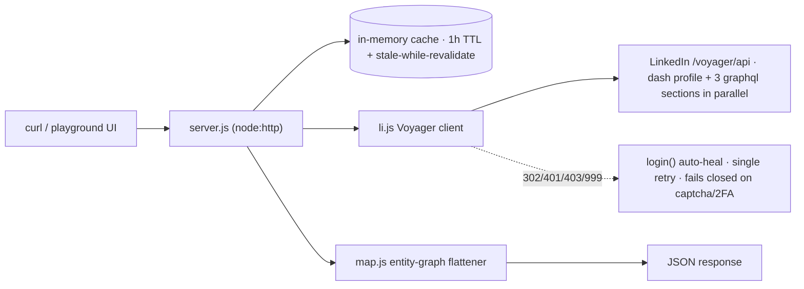

# Design — LinkedIn Profile API

Design-before-code artifact. The system design, API contract, and UI design system are defined here first; `server.js`, `li.js`, `map.js`, and `public/index.html` implement exactly this. Change the design here first, then the code.

## 1. System design

**What:** a hosted HTTPS API that accepts a public LinkedIn profile URL and returns the profile as structured JSON, plus a one-page playground UI that demonstrates it.

**How:** pure reverse-engineered HTTP against LinkedIn's internal Voyager endpoints — the same calls the linkedin.com frontend makes. No browser automation, no SDKs, zero npm dependencies.

```mermaid
flowchart LR
  C["curl / playground UI"] --> S["server.js (node:http)"]
  S --> K[("in-memory cache · 1h TTL + stale-while-revalidate")]
  S --> L["li.js Voyager client"]
  L --> V["LinkedIn /voyager/api · dash profile + 3 graphql sections in parallel"]
  L -. "302/401/403/999" .-> A["login() auto-heal · single retry · fails closed on captcha/2FA"]
  S --> M["map.js entity-graph flattener"] --> J["JSON response"]
```

**Flow:** slug extracted with a strict regex → cache lookup (fresh < 1h served; stale < 2h served + background revalidate; miss fetched) → one dash-profile call returns the whole entity graph → three graphql section calls (skills, certifications, languages) run in parallel and fail soft to `[]` → the mapper flattens the `urn:li:fsd_*` entities into the response schema.

**Error model:** every failure maps to one JSON envelope, `{ "error": { "code", "message" } }`:

| status | code | cause |
|---|---|---|
| 400 | `missing_url` / `bad_url` | no `url` param / not a linkedin.com/in/ URL or valid slug |
| 404 | `profile_not_found` | profile missing or invisible to the backend account |
| 502 | `linkedin_auth` | session cookie expired or flagged |
| 503 | `linkedin_rate_limited` | upstream throttling |
| 502 | `linkedin_<status>` | any other upstream failure |

The UI maps each code to a human message; unknown codes render the raw message.

**Auth model:** `li_at` + `JSESSIONID` session cookies from a real logged-in session, sent with browser-matching headers. LinkedIn pins sessions to IP, so the deployment region is pinned (`bom1`). If cookies expire and `LI_EMAIL`/`LI_PASSWORD` are set, `login()` attempts one programmatic re-login; LinkedIn's captcha/2FA checkpoint (303) is out of scope for pure fetch, so the durable fallback is manual `LI_AT` rotation. Documented limitation, not a design gap.

## 2. API contract

| endpoint | returns |
|---|---|
| `GET /` | demo UI (self-contained HTML) |
| `GET /healthz` | `{ "ok": true }` |
| `GET /profile?url=<url-or-slug>` | 200 schema below, or the error envelope |

**200 schema:**

| field | type | notes |
|---|---|---|
| `url`, `publicId` | string | canonical profile URL + slug |
| `name`, `headline`, `location`, `about` | string \| null | `en_US` locale preferred |
| `images.profile`, `images.background` | url \| null | largest image artifact |
| `experience[]` | `{ title, company, start, end, current, description }` | dates `YYYY` or `YYYY-MM` |
| `education[]` | `{ school, degree, field, start, end }` | |
| `skills[]`, `certifications[]`, `languages[]` | array | fail-soft: `[]` on section error |
| `_meta` | `{ fetchedAt, source, cache }` | `cache`: `hit` / `stale` / absent on fresh |

## 3. UI design system (playground)

Frontend lives in three files, served by `server.js` at `/` with zero build step:
`public/index.html` (markup + inline SVG icon sprite), `public/app.css` (tokens + styles),
`public/app.js` (state, rendering, motion). `GET /profile` responses carry
`access-control-allow-origin: *` so the page is embeddable/callable from any origin.

### Principles

1. **Instrument, not marketing page.** Dark console-first aesthetic with an electric-blue accent, mono micro-type, hairline + glass surfaces. It should read as the control surface of the API it wraps.
2. **One accent, borrowed colors.** LinkedIn-blue family drives actions/links/highlights. Green/amber/red are status-only. Data-derived color is reserved (never decorative rainbow).
3. **Motion with meaning.** Entry staggering, state confirmation, and hover affordances only — every animation answers "what just happened?" Everything is `prefers-reduced-motion`-aware (CSS kills transitions/animations; JS reads the flag for typewriter, counters, and particles).
4. **Real time is the interface.** The console shows live per-request telemetry: `200 OK · 3 roles · 2 schools · 12 skills · 4.1 kb · 412 ms · cache hit`, typed out in the status line.

### Tokens (`:root` in `app.css`)

| token | value | use |
|---|---|---|
| `--bg` / `--bg2` | `#070b13` / `#0a101c` | page / raised |
| `--panel` / `--panel2` | white at 5% / 9% alpha | glass fills |
| `--line` / `--line2` | slate at 16% / 32% | hairlines |
| `--t1` / `--t2` / `--t3` | `#e9eff9` / `#9db0c9` / `#75849d` | text ladder |
| `--acc` / `--acc-hi` | `#5b8cff` / `#9ec2ff` | accent |
| `--ok` / `--warn` / `--err` | `#57e3a0` / `#f5c451` / `#ff7d92` | status only |
| `--grad` | blue→cyan | hero keyword + logo only |
| `--ease` | `cubic-bezier(.16,1,.3,1)` | all motion |
| type | Inter + JetBrains Mono (loaded w/ system fallbacks) | mono = HUD/code/dates |
| radii | 10 / 14 / 20px | s / m / l |

### Anatomy

1. **Ambience** — fixed radial glows + blueprint dot grid + a lightweight canvas particle net (links fade with distance, pauses when hidden/reduced-motion).
2. **Mast** — sticky glass bar that gains a hairline on scroll; brand mark tilts on hover; `live` health pill with a pulsing halo → `/healthz`; github ghost link.
3. **Hero** — kicker pill, gradient-accented display headline, lede, capability chips; all enter on load with a 70ms stagger.
4. **Resolver console** — terminal chrome (traffic dots, corner brackets, origin readout). `❯` prompt + mono input with **live validation** (slug regex mirrors `server.js`; red tint + shake + typed error on submit). Resolve button morphs: arrow → spinner → green ✓ / red ✕ flash, with a light sweep across the console on success. Under the input a reserved status line types the request telemetry; example chips (`williamhgates`, `rbranson`, not-found demo) plus key hints (`/` focus · `↑↓` history · `esc` clear).
5. **Profile dashboard** (`rendered` view) — cover photo banner (blur-in, gradient plain fallback) with overlapping avatar (initials fallback on image error), name/headline/location, action buttons (copy json · copy share link), and a meta chip rail (cache state colored, source, slug, ms, bytes, fetched time). Below, a two-column bento: left = About (auto-fold "read more" when > 4 lines) + Experience (timeline rail, node markers, `now` pulse on current roles, tenure pills); right = Education, Skills, Certifications, Languages — kinetic `#chip` stacks with count tickers; empty sections render a fail-soft note.
6. **JSON view** — profile/json segmented tabs with a sliding glider; syntax-highlighted pane; click-to-select for manual copy.
7. **Loading** — shimmer skeleton mimicking the exact dashboard geometry (banner + avatar + column bars).
8. **Errors** — alert card: icon tile, mono code chip + status, human copy per error code (incl. network), retry/clear actions; console shakes and types `502 linkedin_auth — …`.
9. **Reference** — scroll-revealed endpoint cards (`GET /profile`, `/healthz`, `/`), a live curl bar with in-place copy, and a collapsible response-schema grid + error-code legend.

### Interaction rules

- Success/failure states are **visible in the same view** (button flash, console border, status line, then dashboard) — never a modal, never a toast that shifts layout.
- Copy buttons confirm in place (~1.3s), fall back to execCommand, and the JSON pane click-selects as a last resort.
- `?url=` syncs to the address bar; on load it auto-resolves; `esc` clears; `↑/↓` walks last-12 request history; `/` focuses the prompt.
- Rendered dashboards enter card-by-card (70ms stagger, cubic-bezier rise); counts tick up once.
- **Offline sample mode** — when not on `vercel.app` and the upstream is unreachable/expired (sandbox/self-host without cookies), the playground swaps in a clearly-labeled bundled fictional profile (`sample` badge, `fictional — ui demo data` note) so the whole UI stays demonstrable. Production hosts always show real responses or real errors.

### Accessibility

- `aria-live="polite"` result region + `role=status` log; real `<label>`; visible `:focus-visible` rings; buttons remain keyboard operable.
- AA-contrast text ladder; color is never the only signal (icons + text accompany status colors).
- All motion gated by `prefers-reduced-motion` (CSS + JS) — no shimmer, typewriter, sweep, counters, or particles.

### Audit checklist

- [x] States: idle, validating, fetching (skeleton + busy console), success dashboard, empty sections, typed errors, network failure, sample mode
- [x] One accent + status-only colors; gradients confined to hero keyword / logo / cover fallback
- [x] Keyboard pass: `/` focus → enter resolve → tabs → copy → `esc` clear → `↑` history
- [x] Reduced-motion pass; long-content pass (foldable About/descriptions, wrapping everywhere)
- [x] Responsive pass: 1060→1-col bento at ≤860px; console compresses; no horizontal overflow
